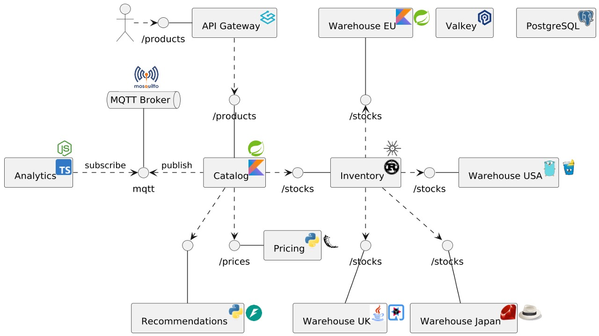
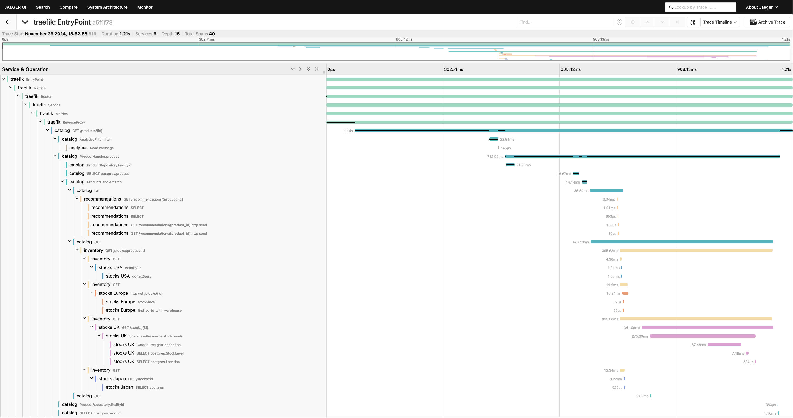

= OpenTelemetry demo

Here's the architecture:

The result is the following

== Build images

You need a local Docker daemon, _e.g._, Docker Desktop or Orbstack.

At the root of the repo, run:

[source,bash]
----
./build.sh
----

== Docker compose usage

If the images are built:

[source,bash]
----
docker compose up
----

If not:

[source,bash]
----
docker compose -f docker-compose-build.yml up
----

Be patient, the stack builds a Rust and a GraalVM-native app (among others).

== Kubernetes usage

* Create the virtual cluster in the `otel` namespace of the host cluster:
+
[source,bash]
----
helm upgrade --install vcluster vcluster/vcluster --namespace otel --create-namespace  --values helm/vcluster.yaml
----
+
* Install the infrastructure components in the `otel` namespace of the host cluster:
+
[source,bash]
----
helm upgrade --install otel-infra ./helm/infra --values helm/infra/values.yaml --namespace otel
----
+
* Connect to the virtual cluster:
+
[source,bash]
----
vcluster connect vcluster
----
+
* Install the application components in the `default` namespace of the virtual cluster:
+
[source,bash]
----
helm upgrade --install otel-apps ./helm/apps --values helm/apps/values.yaml
----
